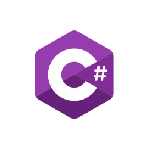

# C\#


While it was built off of C, C# is actually a much different language compared to C or C++. If anything, people have called it a Java knock-off. Developed by Microsoft, this programming language was built to be high-level and run on the .NET framework. What's .NET? It's pretty much the bread and butter of the Windows Operating System. Out of all the "C" languages, C# is the easiest to learn due to its similarity with other programming languages, automatic garbage collection, and wide array of use cases. So, while C# is primarily used for Windows applications, it's also used in other applications, such as creating games in Unity.

## How to Run
Since C# is affiliated with Microsoft, these files run best on Windows. Follow the steps [here](https://www.geeksforgeeks.org/hello-world-in-c-sharp/) to execute on a Windows machine. Outside Windows, you would need to install [Mono](https://www.tutorialspoint.com/executing-chash-code-in-linux) and run the following commands:
```
msc HowToCsharp.cs
./HowToCsharp.exe
```
For more on C#, check out the [documentation](https://docs.microsoft.com/en-us/dotnet/csharp/).
