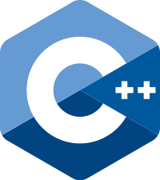

# C++


C++ is an object-oriented extension of the C language created by Bjarne Stroustrup in 1979. In addition to the regular C syntax, C++ supports classes, inheritance, encapsulation, exception handling, and much more. While C++ tends to be criticized for its complicated nature, it is still a widely used language due to its efficient speeds similar to C. If you plan to work with systems that require low-level architecture and fast speeds, expect C++ to play a big part in that role.

## How to Run
Follow the steps [here](https://www.guru99.com/c-gcc-install.html) to install a C++ compiler. Note that these are the same instructions as in C. gcc can be used to compile C++ files, but g++ is recommended. A makefile is included to make compiling easier. Once you're all set up, run the following commands:
```
make all
./HowToC++.out
```

The `.out` file is ignored by git. You can delete it by running `make clean`. For more info on C++, check out the [documentation](https://devdocs.io/cpp/).
