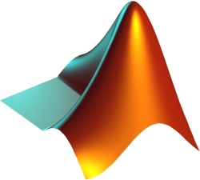

# MATLAB

MATLAB is a tool used by engineers all around. It has many use cases, such as machine learning, robotics, and signal processing. The language is optimized for matrix operations and comes with many advanced math functions. (Think NumPy but more fully fleshed out.) Unfortunately, it's one of the few programming languages that isn't open source. So unless your school or company offers MATLAB, it'll cost some money to take advantage of it.

## How to Run

Download MATLAB [here](https://www.mathworks.com/products.html?s_tid=gn_ps). Choose the license that best suits your needs. Then run `howToMatlab.m` in the MATLAB application.

For more on MATLAB, check out the [documentation](https://www.mathworks.com/help/matlab/).
