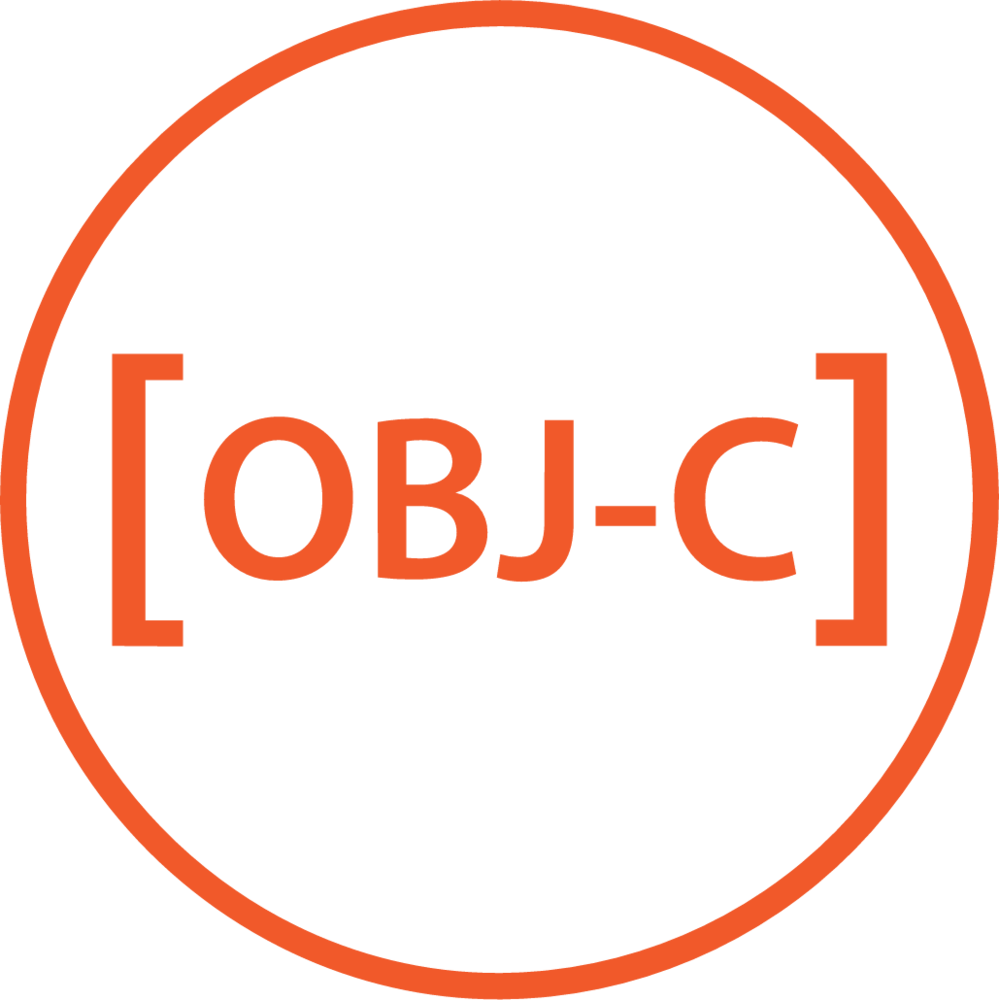

# Objective-C



Objective-C is an object-oriented extension of C created in the 1980s. (If this sounds like deja-vu, C++ was created with the same purpose around the same time.) It was adopted by Steve Jobs after he left Apple to create NeXTSTEP, a competing operating system. Later, Apple would buy NeXT, bring back Steve Jobs, and use their OS to modernize macOS. This is where the NS prefix comes from in many of Objective-C's classes. (Also because the language only has one global namespace.) Objective-C would continue to be widely used in other Apple products, such as iOS, before Swift became their primary language in 2014.

## How to Run

As you might expect, Objective-C applications work best on Macs. You can download Xcode from the App Store and start working in Objective-C right away. Since this file deals with pure Objective-C syntax and not developing a UI, you can either run `main.m` in Xcode or the Terminal. If you're not using a Mac, you can consult an [online IDE](https://www.jdoodle.com/execute-objective-c-online) or try installing Objective-C on [Windows](https://www.gnustep.org/windows/index.html) or [Linux](https://clang.llvm.org/get_started.html) using alternative methods.

If you do have Objective-C installed, run the following commands:

```bash
make all
./HowToObjectiveC.out
```

You can delete the `.out` file by running `make clean`.

For more on Objective-C, check out the [documentation](https://developer.apple.com/library/archive/documentation/Cocoa/Conceptual/ProgrammingWithObjectiveC/Introduction/Introduction.html).
