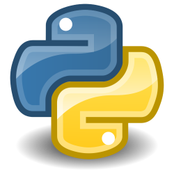

# Python

This was the file that started this whole guide. It wasn't my first language (that honor goes to Java), but I feel this is one of the best languages to start learning, especially if you've never coded before. Python is designed to resemble spoken English with its lightweight syntax and abundant usage of English words. It's used in many areas including, but not limited to, machine learning, Raspberry Pis, and servers.

## How to Run
Make sure to have [Python 3.6+](https://www.python.org/downloads/) installed (to support f-strings). Optionally, [pip3](https://pip.pypa.io/en/stable/) can be installed for additional modules, but they're not required to run this file. Then run the following on the command line:

`python3 how_to_python.py`

For more on Python, visit the [documentation](https://www.python.org/).
