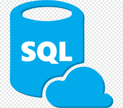

# SQL



SQL (pronounced as either S-Q-L or SEQUEL) is a language used for relational database management. You can set up a database, create a table, and query the data using this one language. It's great for quickly retrieving information in the back-end and is very easy to read since it resembles English. There are many SQL databases to choose from depending on your architecture, such as MySQL, PostgreSQL, and Microsoft SQL Server.

## How to Run

SQLite is the most lightweight database engine, so we'll use that to run the SQL script. Install [SQLite](https://www.sqlite.org/download.html), then run `sqlite3 db.sqlite3 < HowToSQL.sql`.

You can also run the file within sqlite3 by running the following:

```
sqlite3 db.sqlite3
.read HowToSQL.sql
```

To quit, run `.quit`.

For more info on SQL, check out the [documentation](https://www.sqlite.org/docs.html).
