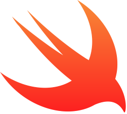

# Swift



Swift is a language developed by Apple for iOS and macOS applications. It's designed to be more modern, concise, and easier to work with than Apple's older language: Objective-C. In fact, Apple is slowly trying to abandon Objective-C all together! Like how C# is to Windows, Swift is mainly used to develop for Apple products. However, that is still a very broad (and lucrative) market for developers to start working on. And one benefit to being tied to Apple is that developers don't need to worry as much about stability or compatibility across all platforms compared to web and Android developers.

## How to Run

As you might expect, Swift applications work best on Macs. You can download Xcode from the App Store and start working in Swift right away. Since this file deals with pure Swift syntax and not developing a UI, you can either run `main.swift` in Xcode or the Terminal (note: `readLine()` doesn't work on the playground). If you're not using a Mac, you can consult an [online IDE](http://online.swiftplayground.run/) or try installing Swift on [Windows](https://swiftforwindows.github.io/) or [Linux](https://swift.org/download/) using alternative methods.

If you do have Swift installed, run the following commands:

```
make all
./main.out
```

You can delete the `.out` file by running `make clean`.

For more on Swift, check out the [documentation](https://swift.org/documentation/).
